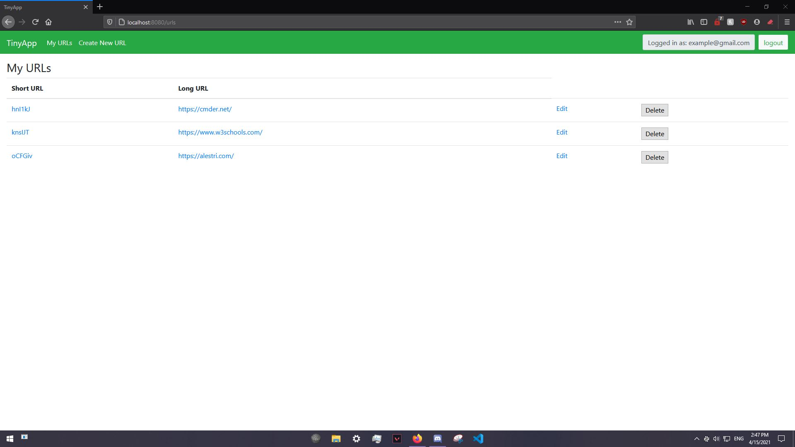
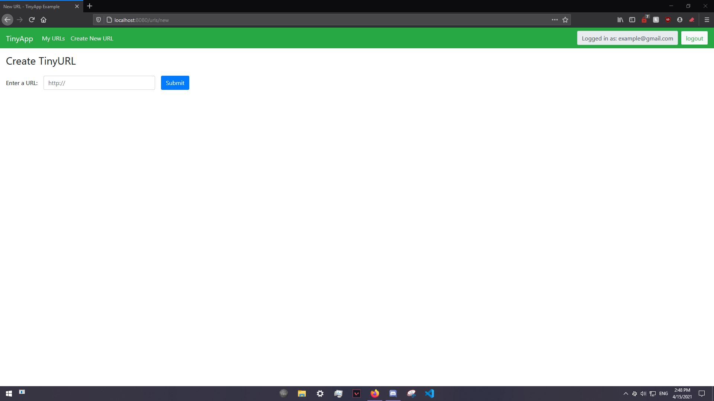
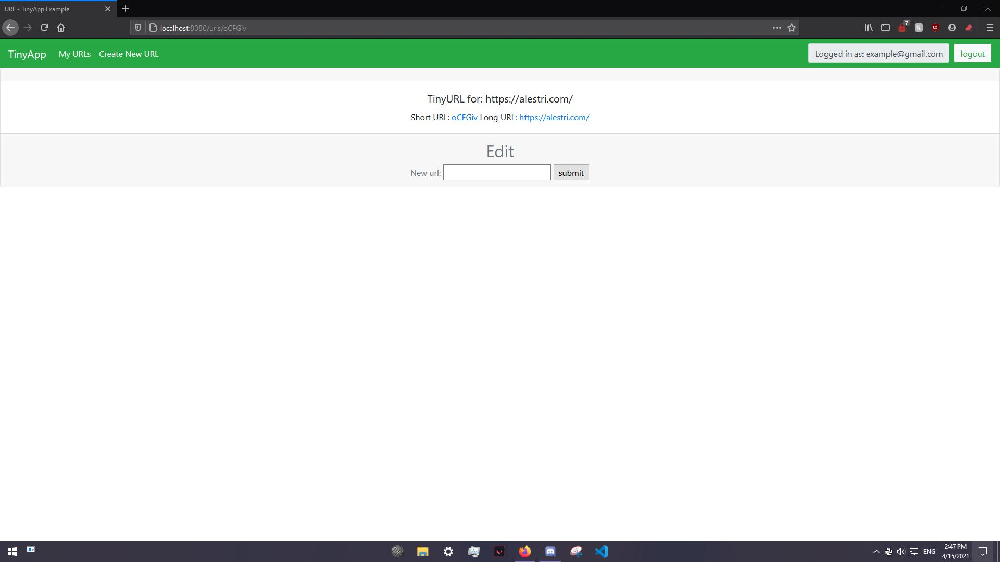

# The Tinyurl Project

---

Tinyurl is a simple website which shortens urls! This javascript site allows for a user to register for an account, login, and create a list of shortened urls that they can then send to friends, jot down on a notepad, and whatever else they so desire to do with it!

The site predominantly uses the technologies, node, express and ejs to allow for quick and snappy execution while allowing for highly readable code!

## Dependencies

- Node.js
- Express
- EJS
- bcrypt
- body-parser
- cookie-session

## Getting Started

- Install all dependencies (using the `npm install` command).
- Run the development web server using the `npm start` command.
- Navigate to `localhost:8080/` or, if you so desire change the port in database.js and use that port instead.

